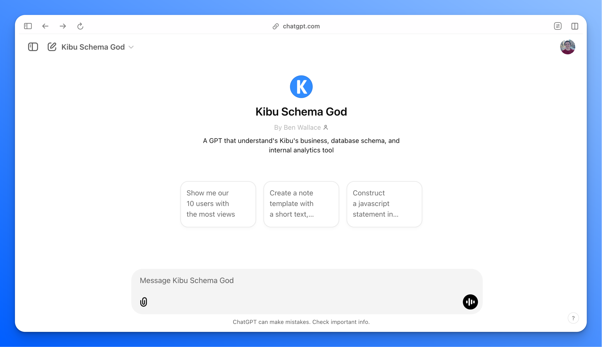
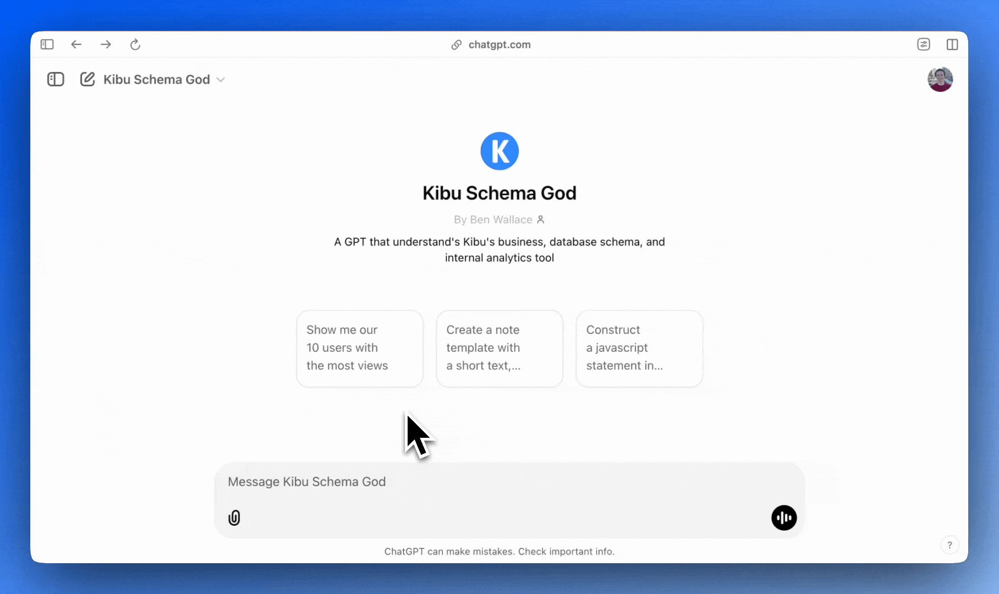
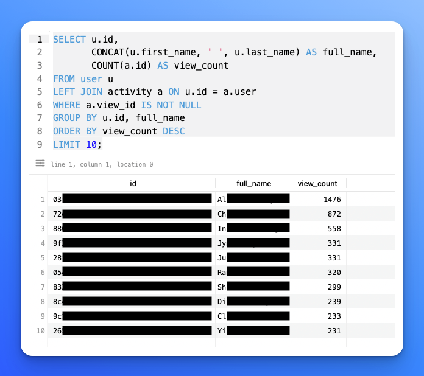
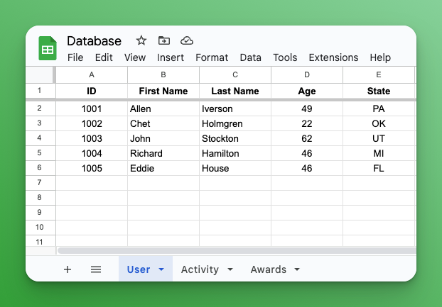

***Quick Update:*** *I updated my domain to ben-mini.com! All old URLs and the RSS feed under `ben-mini.github.io` will automatically redirect, so no changes are needed on your end.*

By far, the most useful LLM app I've made is the Kibu Schema God:

I try not to make my posts too technical, but I can't resist. I'd like to briefly explain what the Kibu Schema God is, how I set it up in a day, and how you might create something similar.

### What it is

The Kibu Schema God (KSG) is a [Custom GPT](https://openai.com/index/introducing-gpts/) that helps me get immediate answers on my product's data. It has full knowledge of my company's database schema and context around it. KSG allows all Kibu employees with a basic understanding of SQL to construct queries that provide insights into our customers. Humbly put, it is an omniscient data deity that takes mortals’ plain-English requests and provides the path to the data in seconds.

As a VP of Customer Success with an engineering background, I use KSG daily to gain insights into our customers' product usage. Which organizations watched the most videos this week? How many time-tracking events occurred after 5 PM ET this month? Relative to ARR, which customers have the most alarmingly low usage? I can copy+paste these exact questions into KSG, and it will return exactly what I need.

The beauty of KSG is that it's completely disconnected from our actual database, ensuring privacy and HIPAA compliance. No customer, user, or health-related data is ever shared with Schema God or the LLM. Further, it took me just a few minutes to create, with occasional tweaking and maintaining- all without code.

### How it Works

This morning, I wanted to know which users watched the most classes on Kibu (by the way, [Kibu](https://www.kibuhq.com) offers a library of 400+ videos of educational and exercise content for adults with special needs). So, I logged onto ChatGPT.com, went into my Kibu Schema God GPT, and asked the question:

Instead of returning data, KSG generates a MySQL query. A query is a structured language that enables interaction with Kibu's MySQL database. I then copy+paste that query into an SQL editor, like [TablePlus](https://tableplus.com/), and view the results:

Not only has KSG saved me hours of writing these tedious queries, but it's also proven worthy in crafting some of the most complex, disgusting, 25+ line queries in my life. I used to think of SQL query writing as an art- now, it's a commodity.

Configuring KSG was relatively simple. When [creating a Custom GPT](https://help.openai.com/en/articles/8554397-creating-a-gpt), I provided the following instructions:

> *You are helpful assistant for Kibu employees to better understand their customer. Kibu is a software tool that supports the IDD community. It offers a library of video classes to individuals and Disability Provider organizations, as well as an admin tool for organizations to take notes & attendance of their members (IDD individuals). Your job is to provide MySQL queries upon request given Kibu's MySQL schema. Always use the provided Prisma schema in schema.txt when constructing a query.*

A ***schema*** is the structure that defines how a database is organized. It includes the tables, columns, data types, relationships, and other elements that shape how data is stored and accessed.

Even a Google Sheet can have a schema. In the image below, the schema of this Google Sheet consists of a User table with five columns (ID, First Name, Last Name, Age, and State) and two other tables (Activity and Medical Info) that are likely related to the User table.

Most production databases and SaaS providers maintain a document that defines your data schema. Kibu's schema is explicitly defined with [Prisma](https://www.prisma.io/). Schemas are written in a structured way that makes them readable to computers but indecipherable to humans. *This is the perfect recipe for an LLM use case.*

When creating KSG, I went to my dev team and requested our Prisma file. I uploaded it to the Kibu Schema God, giving it the blueprints to our database's design. After explaining to the GPT a few nuances (what time zone our dates are in, what each "status" value means in a business context, etc.), KSG was complete. I occasionally tweak KSG's configurations when the schema updates or more context needs added. 

### How to Implement Your Own Schema God

Schema Gods are an awesome way to unleash your data analytics potential with minimal IT overhead. Regardless of your role, you work with data, and you need to get insights from it. Here's how you can build your own Schema God:

##### 1. Identify your data source and find its schema

For someone in Product or CS, this could be your relational database or a layer on top of it (Mixpanel, Amplitude). For a salesperson, your data is likely in a CRM. Ask the owner of this data source for the schema. [Salesforce has its own schema tool](https://trailhead.salesforce.com/content/learn/modules/data_modeling/schema_builder) that lets you view and configure all the objects in your org.

##### 2. Insert the schema into ChatGPT.

Visit ChatGPT.com (or your preferred LLM) and paste your schema into a Custom GPT configuration or start a new conversation.

##### 3. Explain the schema to ChatGPT

Think of your Schema God as a really smart data analyst intern who still needs to learn. Explain your product, its core "nouns", and what a successful answer may look like. The more specific, the better.

##### 4. Ask ChatGPT to return your queries in a desirable format.

Every data repository has its own method of analyzing data. For a database, this will likely be query language. For SaaS apps, it might involve using an "advanced filter" language available in its reporting interface. It might be an API. Salesforce has its own query language called [SOQL](https://developer.salesforce.com/docs/atlas.en-us.soql_sosl.meta/soql_sosl/sforce_api_calls_soql.htm) that runs on sites like [Workbench](https://workbench.developerforce.com/login.php). Find the format that gets you from copy -> paste -> data as quickly as possible.

### Final Thoughts

In about an hour, my six years of SQL knowledge became nearly obsolete. Granted, building and tweaking the Schema God would have been much more challenging without my data fluency, and my more advanced prompts to KSG are still grounded in pseudo-SQL-speak. However, in its current state- with all the context and rules I've provided- I have complete confidence that it can help my non-technical colleagues with minimal mistakes. The best KSG users are those who understand *the business* of Kibu the most, not the codebase. Fuck man… maybe it was a good idea to get that business degree instead of computer science!

This year, "talk to your data" apps have exploded in growth. But, I'm yet to find a tool as cheap, easy to use, and privacy-friendly as the Schema God. Hopefully, this can help some of you become the data-driven business visionary you never knew you could be.