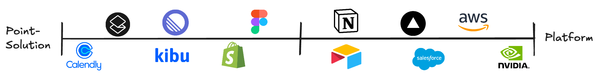

A while back, I wrote a post titled "[What is a Platform?](https://ben-mini.com/2024/what-is-a-platform)". I defined what a platform is and why tech companies are so determined to become labeled as one. My definition of a platform is a tool that allows users to define and build their own **things**, which can be used by other users. Tech companies wish to own platforms, as they are the engines that propel the flywheel toward infinite growth.

But as Bill Simmons puts it best, there's always a good "zag" to every "zig". I want to challenge my own assumptions that platforms are inherently the best business model and explore how the opposite model, point solutions, can be just as healthy in product design. I want to compare two companies I admire: Notion (the platform) and Linear (the point solution). I also want to acknowledge my feelings about [Kibu's](https://kibuhq.com/) place in this battle and how forces like competitors, AI, and market needs influence us.

### Notion, the Platform

Notion, known for its minimalism, speed, and extensibility, has been the techy alternative to Google Docs for almost a decade. Its approach of building 'Lego for software' is [embedded in the company's culture](https://x.com/james_jacoby/status/1897761975037501444) and felt inside its product.

From the beginning, Notion's mission was to allow anyone to create software. But, after realizing that everyday humans had neither the time nor care to develop, they switched to productivity. Create a Notion account today, and you will be greeted with a blank canvas, much like a Word doc. But the real magic is the first time you press the `/` key, which opens a world of blocks, allowing you to seamlessly create lists, tables, charts, mentions, and embeds that all cooperate in the ecosystem of your given folder. Notion called itself *the Lego of software*. With blocks, you can define your own **things**. With a collection of **things**, you can design [templates](https://www.notion.com/templates), which can be consumed by many.

Notion entered a rocky era when it strayed from this path. On Lenny's podcast, CEO Ivan Zhao recounts Notion's "lost years," where he reflects on a failed feature. Notion introduced [Sprints](https://www.notion.com/help/guides/sprints-simplified-notions-sprint-tracking-system), a specific methodology for managing projects. From the start, Ivan and the team felt *Sprints didn't feel right*. After a year, they could articulate that injecting a rigid, less adaptable solution didn’t align with Notion’s core philosophy of block-based design. Imagine opening a box of Legos and finding a perfectly curved, painted airplane inside! Where’s the fun and customization in that??

For Ivan and Notion, anything outside of block-based **thing**-builders is not a tool that belongs in Notion. While incredibly friendly and familiar, Notion is very much a platform.

### Linear, the Point Solution

I've already written about [what makes Linear so beautiful](https://ben-mini.com/2025/whats-preventing-us-from-building-a-beautiful-product). Linear's strength lies in its focus on building the best issue-tracking tool for the IC engineer: the 20-something developer who just wants to code without the bureaucracy. This unwavering focus on a specific persona is what makes them *a point solution for modern software development teams*.

A point-solution mindset is embedded in how Linear decides on features. In an interview with Head of Product Nan Yu, he reflects on one decision (paraphrasing):

> We never liked the idea of letting management add custom fields to Linear because if you add 100+ custom fields, all your ICs would hate it.
>
> But we kept getting requests for it, and we'd ask, *“Well, why do you want custom fields?”* And 40% of customers said, *“Well, I have Customer X, and their request is really important. I need everyone to know that Customer X needs this. I need to track it.”*
>
> ***That*** sounded like a very useful and powerful thing for us to do. So let's build a solution that solves that problem without making ICs' lives harder.

Instead of building custom fields, Linear created [Customer Requests](https://linear.app/customer-requests), which captures issues and tags direct customer quotes from various support channels- all without ICs needing to do anything.

I’m impressed by the incredible discipline Linear exemplifies here. Clearly, the easy and "more scalable" solution would have been to introduce custom fields. But because they knew it would undermine their key persona, they kept poking at *the real problem* and addressed that instead.

In spirit, *Linear and Notion have polar opposite perspectives: Notion welcomes platform-like design with blocks, custom fields, and automations, while Linear rejects it- staying disciplined in building out-of-the-box solutions that fit the lowest common denominator of its addressable market.*

### So, what's right?

Cold take: they're both right, and the lesson is that two roads can lead to equally desirable destinations.

I'm much more focused on the question: *what's right for Kibu?*

*Kibu is already much closer to Linear as a point solution, and I believe it should stay there.* Kibu already has an incredible niche in the Disability Provider market, and we're building real point solutions tailored for Day Habilitation programs within these providers.

Our competitors, namely Therap, take a horizontal approach to their solutions- seeing Disability Providers as just one vertical of many. This forces customers to do upfront and ongoing management of defining generic **things** within Therap. *Some* providers may see this as powerful and extensible- likely large organizations with dedicated IT resources. Kibu's bet is that the vast majority of the market doesn’t have this luxury and would prefer out-of-the-box solutions where **things** are already in their language (service records, attendance, members).

Kibu, as a point solution, makes more sense for the market. Our market is exceptionally non-technical, highly regulated, and rightfully sees software as a secondary asset to their true offerings: the physical facilities and human resources that provide the service. Taken together, my bet is that *our market would rather be told what they need than inspired to build it themselves.* The more specific we can get, the better. A press release that reads *"Kibu launches ready-made solution for Day Habs in Georgia"* will resonate more than *"Kibu introduces custom fields, allowing any organization to build their own solutions."*

Kibu, as a point solution, will open the floodgates for our product team to introduce [omotenashi](https://ben-mini.com/2024/omotenashi)- anticipating our users' needs before they ask. Notifications and help documentation can be more specific. LLM solutions can be prompt-engineered with niche instructions. Our codebase will be hardcoded with the nouns and verbs our market understands, forcing our tech team to truly understand the needs of our users, which is constrained by [our inability to dogfood](https://ben-mini.com/2025/whats-preventing-us-from-building-a-beautiful-product#no-dogfooding).

There’s so much more to unpack with AI’s influence, scaling the "Day Habs in Georgia" solutions, and more. Nevertheless, I believe that point solutions are what our market needs, and our messaging and product decisions should be guided by that assumption.
