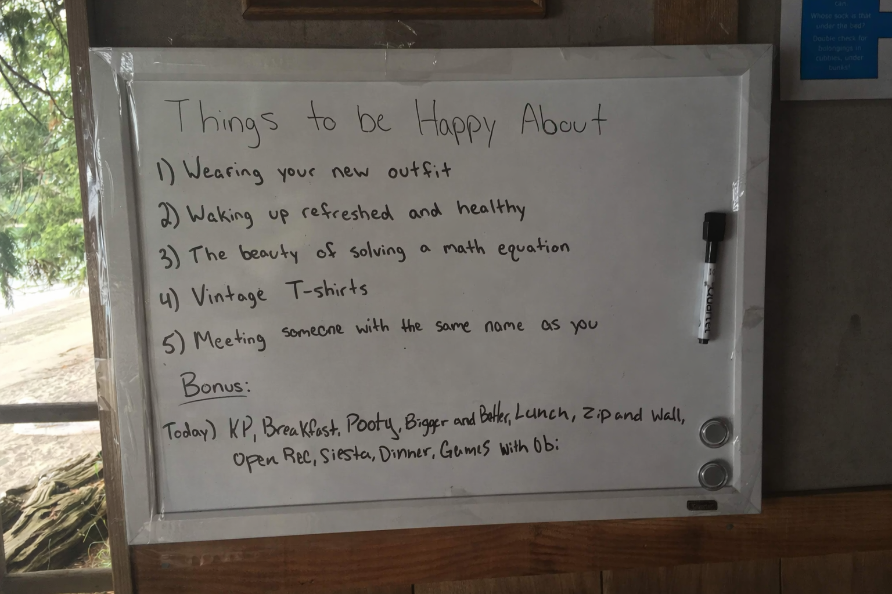

Happy to share a new project: Things to be Happy About - [things.ben-mini.com](https://things.ben-mini.com/). It's a daily blog where I simply write five things to be happy about. 

Back in college, I had a tiny whiteboard outside my dorm where I did the same exercise. I also brought it to my cabin as a camp counselor (below). I would always leave the marker out with a little "Bonus:" section, where any passerby could add what they wanted. Not to brag, but it was quite a hit!

[things.ben-mini.com](https://things.ben-mini.com/) is the same concept: I add my own five things every day, and *anyone on the internet* can add the *Bonus*. Just like the real world, anyone can add, append, or completely write over it. At midnight, the present the *Bonus* is locked- entering a readonly state with all prior entries.¹

What's cool to me is how I built this. You'll be unsurprised to hear that most of this was vibe coded. [Here's the Github](https://github.com/benfwalla/things-to-be-happy-about). The whole site, with a CRUD admin view, was built in a day:

- Claude Code for vibe coding
- Vercel for hosting
- [Convex](https://www.convex.dev/) for db/auth/realtime sync (this product is awesome! I could write a whole post about it. It actually makes the *Bonus* entry realtime across all visitors, like a Google Doc.)
- [BlockNote](https://www.blocknotejs.org/) for an easy Notion-like editor

### Perfect Software

Three years ago, I considered making this a Substack, but it didn’t feel right. I had specific ideas about how to present the daily entries, how my own admin view should work, and how the visitor-contributed *Bonus* should work. Substack couldn’t hold any of that. I had to sacrifice my artistry and workflow in exchange for Substack's convenience.

Last week, I read [Gaurav Ramesh's blog about Perfect Software](https://outofdesk.netlify.app/blog/perfect-software), where he makes the claim that LLMs make it possible to efficiently build small, non-scaling software that is “perfect” because it fits a single person’s needs exactly.

> Before LLMs, “perfect software” was largely a myth. For most of us, the effort required to build exactly what we wanted was simply too high. So we rented other platforms. We begged or waited for features. We accepted friction and exploitation - limitations, ads, data stealth - as the rent.
>
> In the 12 years I’ve written online, I’ve never found the perfect writing and publishing tool. [...] It wasn't because I needed something fancy. It was precisely because I didn’t.
>
> But over the last 18 months, I’ve increased my odds of finding the “perfect software”. Because now, I’m making it.

This revelation is so important and liberating to me. I've written a fair amount about my love of software (I plan to write more!). Vibe coding has reignited that love, as it's allowed me to explore projects like these- faster and better than ever.

With that said, I don’t think Substack, or the broader SaaS market, is *dead*.² While Substack didn’t fit Gaurav’s or my needs, it has for a large denomination of writers. It’s also worth noting that Gaurav and I *sacrificed* Substack’s distribution advantages in exchange for more control over our publications. Still, I think we’re heading in the right direction, and SaaS will need to evolve to retain its users. I imagine SaaS companies beginning to launch **Lovable-like build modes**, with hosting, auth, and APIs already in context. Imagine a world where writers on Substack, sales teams on HubSpot, and healthcare workers on Kibu can all build interfaces that fit their own workflows.

SaaS will become less valuable for its UI and more for its opinionated, shared data layer. The winners in consumer SaaS will have data layers with the strongest distribution. In B2B, it’ll be the ones whose data layers produce trusted guardrails of compliance, reliability, and operational best practices.

It’s a tale as old as time and a recurring theme in *ben-mini*: centralized platforms that provide real, complementary value to builders will continue to dominate tech for the foreseeable future.

Anyways, enjoy [things.ben-mini.com](https://things.ben-mini.com/)! Feel free to drop your own *Bonus* 😄

---

¹ Of course, I reserve the right to remove any inappropriate entries.

² My existing career path depends on SaaS flourishing, so I could be ignorant. "It is difficult to get a man to understand something, when his salary depends on his not understanding it." -Upton Sinclair
