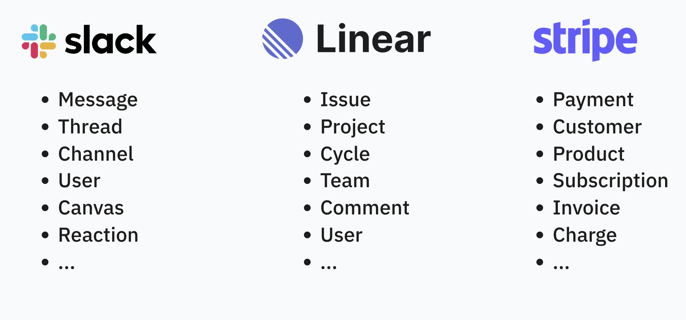
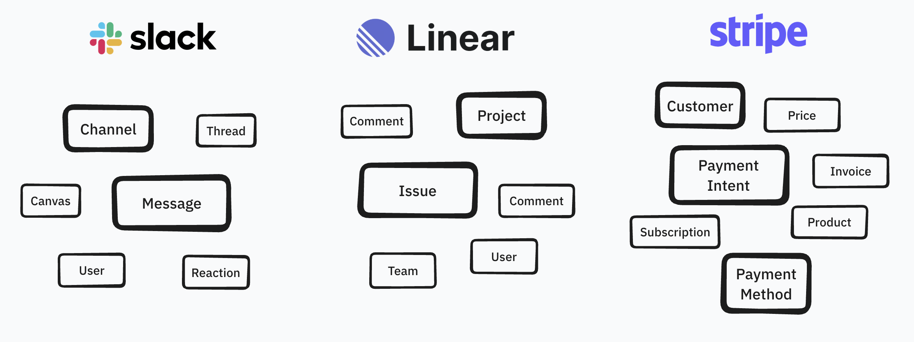

Consider the "nouns" that live inside an app of your choice:

You can spend *hours* building a list for just one app. But the more interesting exercise is *weighting* the nouns in the app- considering which ones have the most "gravity" from the eyes of the user:

You quickly realize that most apps, even the multi-billion dollar ones, revolve around one or two nouns- I like calling these **nucleus nouns**. Every other noun is a "satellite".

Nucleus nouns are how I think about apps. Whenever I'm learning an app for the first time, I consciously build out this gravity model. It's an easy way to cut through the bullshit. I don't care that your app "optimizes sales efficiency with streamlined processes". Fuck that. Oh? Your nucleus noun is "Email"? Got it. Now we're getting somewhere.

Companies with a firm understanding of their nucleus nouns can use them as weapons. They make them part of their brand: *✨ the company that knows X better than anyone else ✨*. If companies lose sight of it, the customer feels it:
- If nucleus nouns are not represented in your marketing materials, buyers feel it.
- If nucleus nouns are not at the top of your API documentation, engineers feel it.
- If nucleus nouns don't impact hiring decisions, expertise will crumble.

Nucleus nouns may seem obvious to many readers. Those that understand the basics of database design might find this second nature. But, I have experienced *major communication breakthroughs* with team members of all technical abilities by explicitly listing out the "nouns in scope" for a new project.

When starting a new project, list out the nouns with your team. Then, consider this:

- Are only **existing** nouns impacted, not new ones? If so, awesome, let's move fast and break things.
- Are any **satellite** nouns introduced? If so, alright, let's consider its relationships, UX, and see if the business value justifies these new nouns.
- Are any **nucleus** nouns introduced? If so, stop everything. Call in the CEO. Rip out the ayahuasca. This decision could change everything.

I'm reminded of [Dylan Fields' reflection](https://www.lennysnewsletter.com/p/why-ai-makes-design-craft-and-quality-the-new-moat) of Figma's release of Figjam: its second product behind its flagship "Design" offering. For an ambitious tech executive, Dylan was awfully pensive about working on a second product (Figjam was released 9 years after Figma's creation in 2012). I think it was the recognition that a new nucleus creates inertia: huge upside if it works, but at what cost?

I'm optimistic in the apps that maintain a uni- or duo-nucleus nouns strategy. Resend is *nailing* email automation. Plaid is *nailing* bank linking. To me, this is *craft*: having the discipline to stick to your nucleus noun and go mega vertical with it. Explore all its quirks and edge cases. Honestly, **I think this is the most likely way to win in the SaaSpocalypse**. Being "okay" at a lot of things won't cut it anymore. Your market can vibecode "okay" in a weekend. Craft, focus, and expertise are your moats. I guess some things don't change.